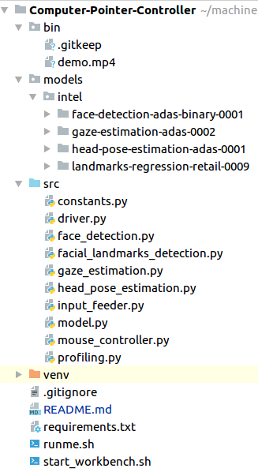

# Computer Pointer Controller

As name says, it controls the computer's mouse pointer with eye gaze.
We have used 4 pre-trained model that is provided by Open Model Zoo.
The project's main aim is to check usage of OpenVino ToolKit on different hardware
which includes openvino inference API, OpenVino WorkBench and VTune Profiler.

## Project Set Up and Installation

Download [OpenVino ToolKit](https://software.intel.com/content/www/us/en/develop/tools/openvino-toolkit/choose-download.html) and install it locally.

Just execute <i>runme.sh</i> from working directory to install prerequisites and you are good to go !!

    ./runme.sh

## Demo

We have provided three ways to run the application
1. Static Image JPEG/PNG
2. Video File
3. [IP WebCam](https://play.google.com/store/apps/details?id=com.pas.webcam&hl=en_US) from Android App

You need to execute following command from the root directory of the project with your configuration.
    
    python src/driver.py -f models/intel/face-detection-adas-binary-0001/INT1/face-detection-adas-binary-0001.xml -l models/intel/landmarks-regression-retail-0009/FP16/landmarks-regression-retail-0009.xml -hp models/intel/head-pose-estimation-adas-0001/FP16/head-pose-estimation-adas-0001.xml -ge models/intel/gaze-estimation-adas-0002/FP16/gaze-estimation-adas-0002.xml -i bin/demo.mp4 -it video -d CPU -debug headpose gaze

Please check following video to get more information on "How to run".

## Documentation

###### Command Line Arguments for Running the app

Argument|Type|Description
| ------------- | ------------- | -------------
-f | Mandatory | Path to .xml file of Face Detection model.
-l | Mandatory | Path to .xml file of Facial Landmark Detection model.
-hp| Mandatory | Path to .xml file of Head Pose Estimation model.
-ge| Mandatory | Path to .xml file of Gaze Estimation model.
-i| Mandatory | Path to video file or enter cam for webcam
-it| Mandatory | Provide the source of video frames.
-debug  | Optional | To debug each model's output visually, type the model name with comma seperated after --debug
-ld | Optional | linker libraries if have any
-d | Optional | Provide the target device: 

###### Directory Structure

- <b>bin</b> folder contains the media files
- <b>models</b> folder contains pre-trained models from Open Model Zoo
    - intel
        1. face-detection-adas-binary-0001
        2. gaze-estimation-adas-0002
        3. head-pose-estimation-adas-0001
        4. landmarks-regression-retail-0009
- <b>src</b> folder contains python files of the app
    + [constants.py](./src/constants.py) : All static constansts of the app located here
    + [driver.py](./src/driver.py) : Main driver script to run the app
    + [face_detection.py](./src/face_detection.py) : Face Detection related inference code
    + [facial_landmarks_detection.py](./src/facial_landmarks_detection.py) : Landmark Detection related inference code
    + [gaze_estimation.py](./src/gaze_estimation.py) : Gaze Estimation related inference code
    + [head_pose_estimation.py](./src/head_pose_estimation.py) : Head Pose Estimation related inference code
    + [input_feeder.py](./src/input_feeder.py) : input selection related code
    + [model.py](./src/model.py) : started code for any pre-trained model
    + [mouse_controller.py](./src/mouse_controller.py) : Mouse Control related utilities.
    + [profiling.py](./src/profiling.py) : To check performance of script line by line
    
- <b>.gitignore</b> listing of files that should not be uploaded to GitHub
- <b>README.md</b> File that you are reading right now.
- <b>requirements.txt</b> All the dependencies of the project listed here
- <b>runme.sh</b> one shot execution script that covers all the prerequisites of the project.
- <b>start_workbench.sh</b> Helper file from intel to start OpenVino Workbench

## Benchmarks

Precision| Inference Time | FPS | Model Loading Time
| ------------- | ------------- | ------------- | -------------
INT8 | |  | 
FP16 | |  | 
FP32 | |  | 

Comment: 
1. Comparing the above graph we can say that FPGA works very slow as it is taking high inference time and low FPS.
2. Intel Atom x7-E3950 UP2 GPU takes so much time to load the model compared to others
3. Intel Core i5-6500TE GPU provides faster inference & FPS in all precisions.
4. Howerver Model Loading Time for Intel Core i5-6500TE GPU is quite high compared to Intel Core i5-6500TE CPU
5. Intel Core i5-6500TE CPU also provides simillar performance like 65000TE GPU with merly decrease in FPS and increase in Inference Time.
6. So 1st priority is to run the application on Intel Core i5-6500TE GPU and then if its not in budget then running on CPU (Intel Xeon E3-1268L v5 & Intel Core i5-6500TE) works well with some lose in FPS and Inference Speed,

## Results

- ##### face-detection-adas-0001
    Benchmark result on my <b>Intel(R) Core(TM) i7-4790 CPU @ 3.60GHz</b> using OpenVino Workbench.
    
    Precision: INT8
    
    
    Precision: FP16
    
    
    Precision: FP32
    
  
  <b>Comment:</b> Comparing the above benchmarks, We can see that INT8 model is very slow in terms of
  throughput and latency compared to FP16 and FP32. The above benchmarks ran on the batch of 100 auto-generated images. Hence 
  the accuracy comparison is not available.
  
  The best precision model should be the one who has higher throughput which is FP16 in this case.

- ##### gaze-estimation-adas-0002
    Benchmark result on my <b>Intel(R) Core(TM) i7-4790 CPU @ 3.60GHz</b>.
    
    Precision: INT8
    
    
    Precision: FP16
    
    
    Precision: FP32
    
   
   <b>Comment:</b> Here in gaze estimation, We have lower performance on FP16 precision because of higher latency and lower throughput 
   in compared to other models.
   
   The best precision model should be INT8 which has lower latency and higher throughput.

- ##### head-pose-estimation-adas-0001
    Benchmark result on my <b>Intel(R) Core(TM) i7-4790 CPU @ 3.60GHz</b>.
        
    Precision: FP16
    
    
    Precision: FP32
    
    
    <b>Comment:</b> The both model performance is quite simillar in terms of latency but based on throughput
    FP16 works well compared to FP32.
   

- ##### landmarks-regression-retail-0009
    Benchmark result on my <b>Intel(R) Core(TM) i7-4790 CPU @ 3.60GHz</b>.
        
    Precision: FP16
    
    
    Precision: FP32
    

    <b>Comment:</b> Same goes here also. The both model performance is quite simillar in terms of latency but based on throughput
    FP16 works well compared to FP32.

The main reason behind the diffrences of latency, throughput and accuracy is because of the floating point convertion.

Converting the higher precisions model to lower one loose some information which leads to loose in some amount of accuracy.

For Example: 1.223154 (FP16) has 0.2223154 valuable information but converting it to (INT8), it looses that information and becomes 1.

The diffrence in latency and throughput is dependent on CPU architecture like how many Floating Point Operations the CPU can able to process in one cycle.

## Stand Out Suggestions

- IP Web Cam:
    
    We have added one more source of input that is ip-cam. We assume that not all computers are connected through webcam so to get the realtime 
    feel of the project we have used feed of IP WEB CAM to get the live feed from an android app.
- Line Profiler:
    
    We did analysis of our code to get the idea about which line takes how much time to execute to optimze the code if any non inference related code takes
    more time than actual inference like pre-processing then using diffrent techniques,
    
    Please find the report of line profiler of driver script from [here.](./driver_LineProfiler_Report)

### Async Inference
We used the start_async method but in next line wait(-1) as well so it behaves like sync or infer method.

We know using async will user the all cores of my CPU and improves the performance of app using threading compared to normal infer method.

### Edge Cases
1. Moving Mouse Pointer out of the maximum window width
2. Face Not Found
3. Multiple Faces (Right now chose the biggest area one as it would be a nearer to webcam in general)
4. Wrong Video/Image file given
